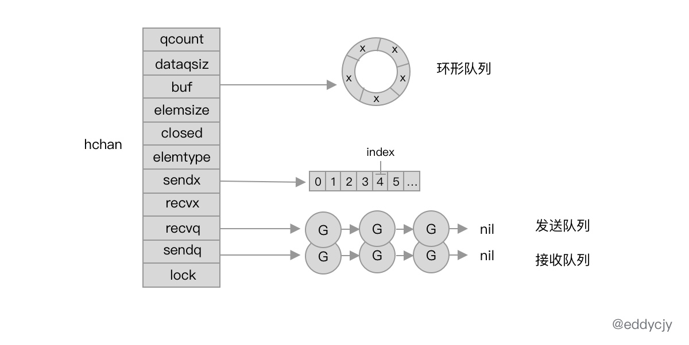

基本原理
本质上 channel 在设计上就是环形队列。其包含发送方队列、接收方队列，加上互斥锁 mutex 等结构。

channel 是一个有锁的环形队列：

hchan 结构体是 channel 在运行时的具体表现形式：

// src/runtime/chan.go

type hchan struct {

    qcount   uint            //队列中的元素总数量
    dataqsiz uint            //循环队列的长度
    buf      unsafe.Pointer  //指向长度为 dataqsiz 的底层数组，仅有当 channel 为缓冲型的才有意义
    elemsize uint16          //能够接受和发送的元素大小
    closed   uint32          //是否关闭
    elemtype *_type          //能够接受和发送的元素类型
    sendx    uint            //已发送元素在循环队列中的索引位置
    recvx    uint            //已接收元素在循环队列中的索引位置
    recvq    waitq           //接受者的 sudog 等待队列（缓冲区不足时阻塞等待的 goroutine）
    sendq    waitq           //发送者的 sudog 等待队列

	lock mutex
}

recvq 和 sendq，其表现为等待队列，其类型为 runtime.waitq 的双向链表结构：

type waitq struct {

    first *sudog
    last  *sudog
}

runtime.sudog 结构体：

//  Go 语言中用于存放协程状态为阻塞的 goroutine 的双向链表抽象, 一个正在等待的 goroutine
type sudog struct {

    g *g                //指向当前的 goroutine

	next *sudog         //指向下一个 g
	prev *sudog         //指向上一个 g
	elem unsafe.Pointer //数据元素，可能会指向堆栈
	...
}

channel 实现原理
makechan 方法的逻辑比较简单，就是创建 hchan 并分配合适的 buf 大小的堆上内存空间。

创建：
ch := make(chan string)

// 通用创建方法
func makechan(t *chantype, size int) *hchan

// src/runtime/chan.go

func makechan(t *chantype, size int) *hchan {

    elem := t.elem
    mem, _ := math.MulUintptr(elem.size, uintptr(size))

	var c *hchan
	switch {
	case mem == 0:
		c = (*hchan)(mallocgc(hchanSize, nil, true))
		c.buf = c.raceaddr()
	case elem.ptrdata == 0:
		c = (*hchan)(mallocgc(hchanSize+mem, nil, true))
		c.buf = add(unsafe.Pointer(c), hchanSize)
	default:
		c = new(hchan)
		c.buf = mallocgc(mem, elem, true)
	}

	c.elemsize = uint16(elem.size)
	c.elemtype = elem
	c.dataqsiz = uint(size)
	lockInit(&c.lock, lockRankHchan)

	return c
}

创建 channel 的逻辑主要分为三大块：

当前 channel 不存在缓冲区，也就是元素大小为 0 的情况下，就会调用 mallocgc 方法分配一段连续的内存空间。
当前 channel 存储的类型存在指针引用，就会连同 hchan 和底层数组同时分配一段连续的内存空间。
通用情况，默认分配相匹配的连续内存空间。

channel 的创建都是调用的 mallocgc 方法，也就是 channel 都是创建在堆上的。
channel 是会被 GC 回收的，自然也不总是需要 close 方法来进行显示关闭。

缓冲发送

send

调用 sendDirect 方法将待发送的数据直接拷贝到待接收变量的内存地址（执行栈）。
例如：msg := <-ch 语句，也就是将数据从 ch 直接拷贝到了 msg 的内存地址。
调用 sg.g 属性， 从 sudog 中获取等待接收数据的 goroutine，并传递后续唤醒所需的参数。
调用 goready 方法唤醒需接收数据的 goroutine，期望从 _Gwaiting 状态调度为 _Grunnable。

recv:
直接接收（不存在缓冲区）：
调用 recvDirect 方法，其作用与 sendDirect 方法相对，会直接从发送方的 goroutine 调用栈中将数据拷贝过来到接收方的 goroutine。
缓冲接收（存在缓冲区）：
调用 chanbuf 方法，根据 recvx 索引的位置读取缓冲区元素，并将其拷贝到接收方的内存地址。
拷贝完毕后，对 sendx 和 recvx 索引位置进行调整。

