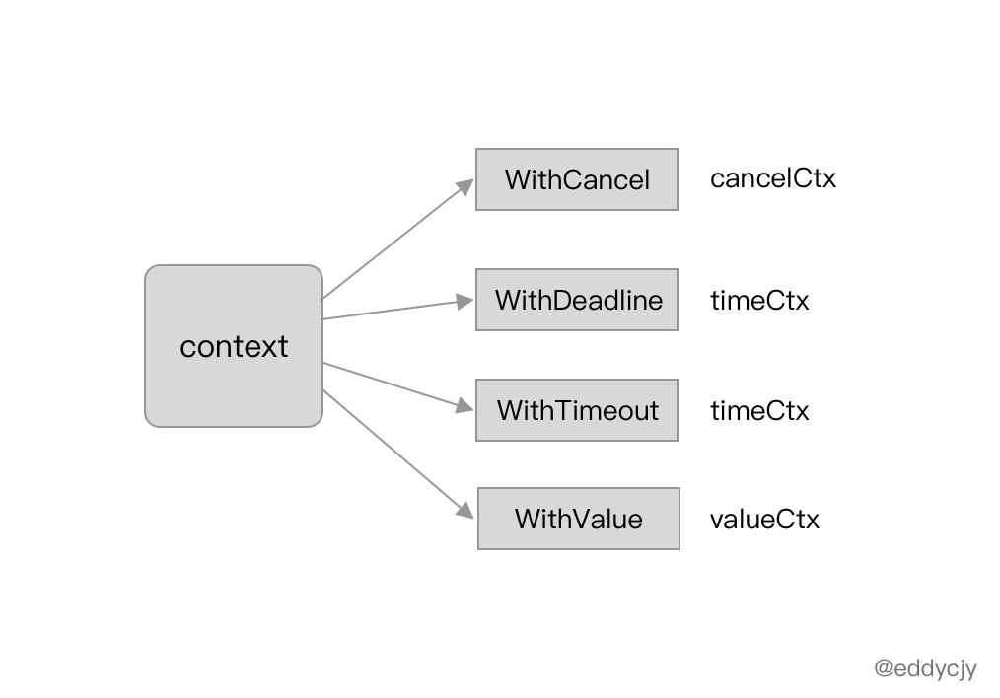
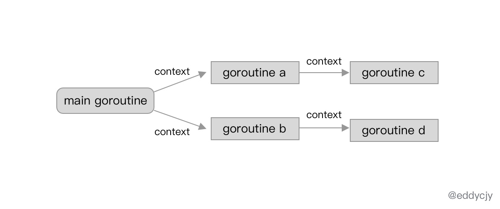
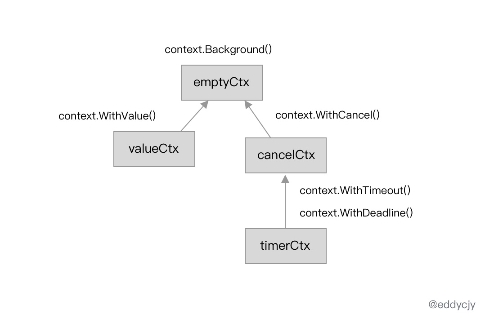
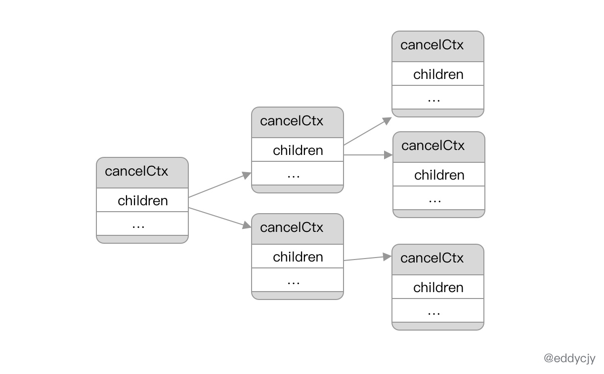

context:
作用是在 goroutine 中进行上下文的传递,传递信息中又包含了 goroutine 的运行控制、上下文信息传递等功能。.

标准库 context 的定位是上下文控制,会在跨 goroutine 中进行传播

Go 语言是基于 context 来实现和搭建了各类 goroutine 控制的，并且与 select-case 联合，就可以实现进行上下文的截止时间、信号控制、信息传递等跨 goroutine 的操作。

func main() {

    parentCtx := context.Background()
    ctx, cancel := context.WithTimeout(parentCtx, 1*time.Millisecond)
    defer cancel()

	select {
	case <-time.After(1 * time.Second):
		fmt.Println("overslept")
	case <-ctx.Done():
		fmt.Println(ctx.Err())
	}
}

我们通过调用标准库 context.WithTimeout 方法针对 parentCtx 变量设置了超时时间，并在随后调用 select-case 进行 context.Done 方法的监听，最后由于达到截止时间。
因此逻辑上 select 走到了 context.Err 的 case 分支，最终输出 context deadline exceeded。

标准库 context 还支持下述方法：

    基于父级 context，创建一个可以取消的新 contex
    func WithCancel(parent Context) (ctx Context, cancel CancelFunc)

    //基于父级 context，创建一个具有截止时间（Deadline）的新 context
    func WithDeadline(parent Context, d time.Time) (Context, CancelFunc)

    //基于父级 context，创建一个具有超时时间（Timeout）的新 context。
    func WithTimeout(parent Context, timeout time.Duration) (Context, CancelFunc)

 type Context

    //创建一个空的 context，一般常用于作为根的父级 context
    func Background() Context
    //创建一个空的 context，一般用于未确定时的声明使用
    func TODO() Context
    //基于某个 context 创建并存储对应的上下文信息
    func WithValue(parent Context, key, val interface{}) Context

WithXXXX ,返回值分别是 Context 和 CancelFunc，接下来我们将进行分析这两者的作用。

Context 接口：

type Context interface {

    Deadline() (deadline time.Time, ok bool) // 获取当前 context 的截止时间
    Done() <-chan struct{}                   // 获取一个只读的 channel，类型为结构体。可用于识别当前 channel 是否已经被关闭，其原因可能是到期，也可能是被取消了。
    Err() error                              // 获取当前 context 被关闭的原因。
    Value(key interface{}) interface{}       // 获取当前 context 对应所存储的上下文信息。

}

Canceler 接口：

type canceler interface {

    cancel(removeFromParent bool, err error)   //调用当前 context 的取消方法
    Done() <-chan struct{}                     //可用于识别当前 channel 是否已经被关闭

}

在标准库 context 的设计上，一共提供了四类 context 类型来实现上述接口。分别是 emptyCtx、cancelCtx、timerCtx 以及 valueCtx。

emptyCtx
日常使用中，常常使用到的 context.Background 方法，又或是 context.TODO 方法。
本质上都是基于 emptyCtx 类型的基本封装。

var (

    background = new(emptyCtx)
    todo       = new(emptyCtx)

)

func Background() Context {
    return background
}

func TODO() Context {
    return todo
}

emptyCtx 类型本质上是实现了 Context 接口

type emptyCtx int

func (*emptyCtx) Deadline() (deadline time.Time, ok bool) {
    return
}

func (*emptyCtx) Done() <-chan struct{} {
    return nil
}

func (*emptyCtx) Err() error {
    return nil
}

func (*emptyCtx) Value(key interface{}) interface{} {
    return nil
}

emptyCtx 类型的 context 的实现非常简单，因为他是空 context 的定义，因此没有 deadline，更没有 timeout，可以认为就是一个基础空白 context 模板。

context 取消事件
WithCancel 和 WithDeadline 都会涉及到 propagateCancel 方法，其作用是构建父子级的上下文的关联关系，若出现取消事件时，就会进行处理：

func propagateCancel(parent Context, child canceler) {

    done := parent.Done()
    if done == nil {
        return
    }

	select {
	case <-done:
		child.cancel(false, parent.Err())
		return
	default:
	}
	...
}

当父级上下文（parent）的 Done 结果为 nil 时，将会直接返回，因为其不会具备取消事件的基本条件，可能该 context 是 Background、TODO 等方法产生的空白 context。

当父级上下文（parent）的 Done 结果不为 nil 时，则发现父级上下文已经被取消，作为其子级，该 context 将会触发取消事件并返回父级上下文的取消原因。

func propagateCancel(parent Context, child canceler) {

    if p, ok := parentCancelCtx(parent); ok {
        p.mu.Lock()
        if p.err != nil {
            child.cancel(false, p.err)
        } else {
            if p.children == nil {
                p.children = make(map[canceler]struct{})
            }
            p.children[child] = struct{}{}
        }
        p.mu.Unlock()
    } else {
        atomic.AddInt32(&goroutines, +1)
        go func() {
            select {
                case <-parent.Done():
                child.cancel(false, parent.Err())
                case <-child.Done():
            }
        }()
    }
}

经过前面一个代码片段的判断，已得知父级 context 未触发取消事件，当前父级和子级 context 均正常（未取消）。

调用 parentCancelCtx 方法找到具备取消功能的父级 context。并将当前 context，也就是 child 加入到 父级 context 的 children 列表中，等待后续父级 context 的取消事件通知和响应
调用 parentCancelCtx 方法没有找到，将会启动一个新的 goroutine 去监听父子 context 的取消事件通知。

cancelCtx 类型的上下文包含了其下属的所有子节点信息：

在 children 属性的 map[canceler]struct{} 存储结构上就已经支持了子级关系的查找，也就自然可以进行取消事件传播了。

而具体的取消事件的实际行为，则是在前面提到的 propagateCancel 方法中，会在执行例如 cacenl 方法时，会对父子级上下文分别进行状态判断，若满足则进行取消事件，并传播给子级同步取消。

