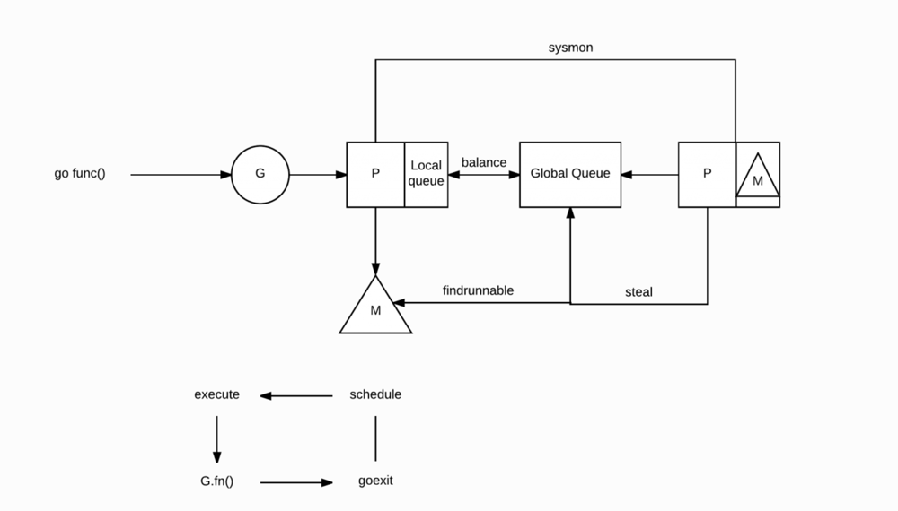
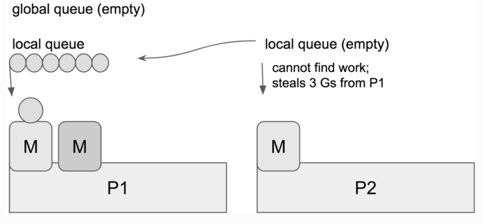

Goroutine 数量控制在多少合适，会影响 GC 和调度？

操作系统本身是无法明确感知到 Goroutine 的存在的，Goroutine 的操作和切换归属于 “用户态” 中。

Goroutine 由特定的调度模式来控制，以 “多路复用” 的形式运行在操作系统为 Go 程序分配的几个系统线程上。

同时创建 Goroutine 的开销很小，初始只需要 2-4k 的栈空间。Goroutine 本身会根据实际使用情况进行自伸缩，非常轻量。

G：Goroutine，实际上我们每次调用 go func 就是生成了一个 G

P：Processor，处理器，一般 P 的数量就是处理器的核数，可以通过 GOMAXPROCS 进行修改。

M：Machine，系统线程。

M: N 调度模型

M 必须与 P 进行绑定，然后不断地在 M 上循环寻找可运行的 G 来执行相应的任务。

    当我们执行 go func() 时，实际上就是创建一个全新的 Goroutine，我们称它为 G。
    新创建的 G 会被放入 P 的本地队列（Local Queue）或全局队列（Global Queue）中，准备下一步的动作。需要注意的一点，这里的 P 指的是创建 G 的 P。
    唤醒或创建 M 以便执行 G。
    不断地进行事件循环
    寻找在可用状态下的 G 进行执行任务
    清除后，重新进入事件循环

全局和本地这两类队列，其实在功能上来讲都是用于存放正在等待运行的 G，但是不同点在于，本地队列有数量限制，不允许超过 256 个.

在新建 G 时，会优先选择 P 的本地队列，如果本地队列满了，则将 P 的本地队列的一半的 G 移动到全局队列.

窃取行为

当你创建新的 G 或者 G 变成可运行状态时，它会被推送加入到当前 P 的本地队列中。
当 P 执行 G 完毕后，它也会 “干活”，它会将其从本地队列中弹出 G，同时会检查当前本地队列是否为空，如果为空会随机的从其他 P 的本地队列中尝试窃取一半可运行的 G 到自己的名下。

P2 在本地队列中找不到可以运行的 G，它会执行 work-stealing 调度算法，随机选择其它的处理器 P1，并从 P1 的本地队列中窃取了三个 G 到它自己的本地队列中去。

并发的限制

1.M的限制
协程的执行中，真正干活的是 GPM 中的 M（系统线程），G 是用户态上的东西，最终执行都是得映射，对应到 M 这一个系统线程上去运行。

M 的默认数量限制是 10000，如果超出则会报错：GO: runtime: program exceeds 10000-thread limit

通常只有在 Goroutine 出现阻塞操作的情况下，才会遇到这种情况，这可能也预示着你的程序有问题。若确切是需要那么多，还可以通过 debug.SetMaxThreads 方法进行设置。

2.G 的限制
理论上会受内存的影响。假设一个 Goroutine 创建需要 4k连续内存：
4k * 1,000,000 = 4,000,000k ≈ 4G内存

3.P 的限制
P 的数量受环境变量 GOMAXPROCS 的直接影响。
在 Go 语言中，通过设置 GOMAXPROCS，用户可以调整调度中中 P（Processor）的数量。

与 P 相关联的的 M（系统线程），是需要绑定 P 才能进行具体的任务执行的，因此 P 的多少会影响到 Go 程序的运行表现。
P 的数量基本是受本机的核数影响，没必要太过度纠结他。
P 的数量不会影响 Goroutine 的数量。

2.