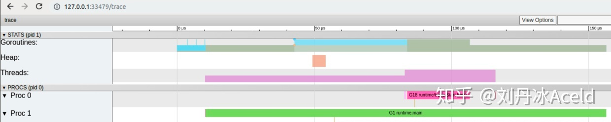
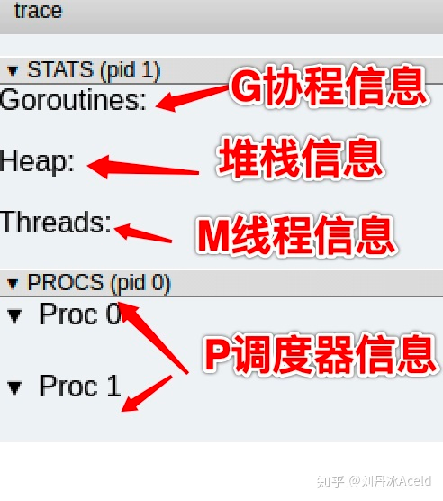
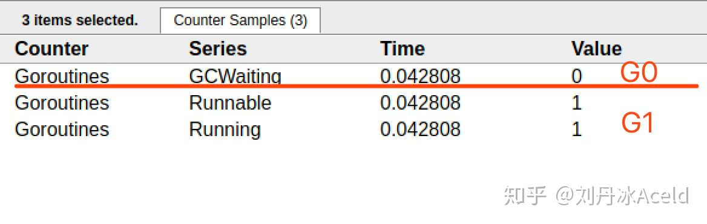
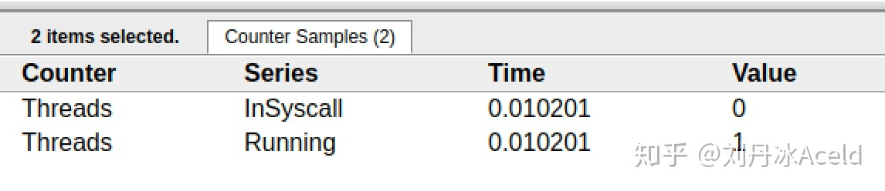
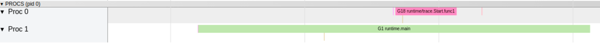
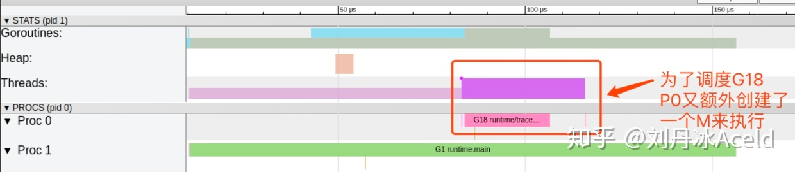
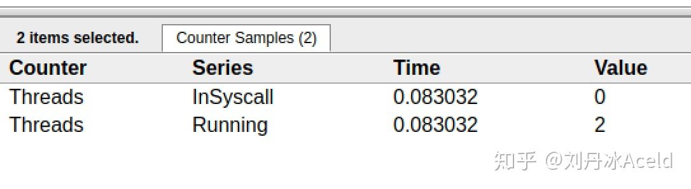

package gpm

import (
	"fmt"
	"os"
	"runtime/trace"
)

func main() {

	//创建trace文件
	f, err := os.Create("trace.out")
	if err != nil {
		panic(err)
	}

	defer f.Close()

	//启动trace goroutine
	err = trace.Start(f)
	if err != nil {
		panic(err)
	}
	defer trace.Stop()

	//main
	fmt.Println("Hello World")
}

运行程序

$ go run trace.go
Hello World

会得到一个trace.out文件，然后我们可以用一个工具打开，来分析这个文件。

$ go tool trace trace.out
2020/02/23 10:44:11 Parsing trace...
2020/02/23 10:44:11 Splitting trace...
2020/02/23 10:44:11 Opening browser. Trace viewer is listening on http://127.0.0.1:33479

我们可以通过浏览器打开http://127.0.0.1:33479网址，点击view trace 能够看见可视化的调度流程。

点击Goroutines那一行可视化的数据条，我们会看到一些详细的信息。

一共有两个G在程序中，一个是特殊的G0，是每个M必须有的一个初始化的G，这个我们不必讨论。
其中G1应该就是main goroutine(执行main函数的协程)，在一段时间内处于可运行和运行的状态。

点击Threads那一行可视化的数据条，我们会看到一些详细的信息。

一共有两个M在程序中，一个是特殊的M0，用于初始化使用，这个我们不必讨论。

中调用了main.main，创建了trace goroutine g18。G1运行在P1上，G18运行在P0上。

这里有两个P，我们知道，一个P必须绑定一个M才能调度G。

我们在来看看上面的M信息。

确实G18在P0上被运行的时候，确实在Threads行多了一个M的数据，点击查看如下：

多了一个M2应该就是P0为了执行G18而动态创建的M2.

