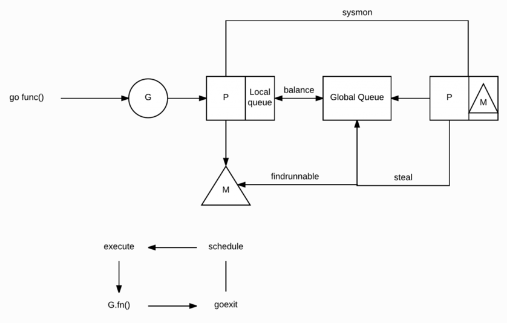

G：Goroutine，实际上我们每次调用 go func 就是生成了一个 G。

P：处理器，一般为处理器的核数，可以通过 GOMAXPROCS 进行修改。

M：OS 线程

Go 的 M: N 调度模型
M 必须与 P 进行绑定，然后不断地在 M 上循环寻找可运行的 G 来执行相应的任务

    1.当我们执行 go func() 时，实际上就是创建一个全新的 Goroutine，我们称它为 G
    
    2.新创建的 G 会被放入 P 的本地队列（Local Queue）或全局队列（Global Queue）中，准备下一步的动作
    
    3.唤醒或创建 M 以便执行 G
    
    4.不断地进行事件循环
    
    5.寻找在可用状态下的 G 进行执行任务
    
    6.清除后，重新进入事件循环

全局和本地这两类队列，其实在功能上来讲都是用于存放正在等待运行的 G，但是不同点在于，本地队列有数量限制，不允许超过 256 个。
并且在新建 G 时，会优先选择 P 的本地队列，如果本地队列满了，则将 P 的本地队列的一半的 G 移动到全局队列，这其实可以理解为
调度资源的共享和再平衡

steal 行为:
当你创建新的 G 或者 G 变成可运行状态时，它会被推送加入到当前 P 的本地队列中。但其实当 P 执行 G 完毕后，它也会 “干活”，它会将其
从本地队列中弹出 G，同时会检查当前本地队列是否为空，如果为空会随机的从其他 P 的本地队列中尝试窃取一半可运行的 G 到自己的名下

