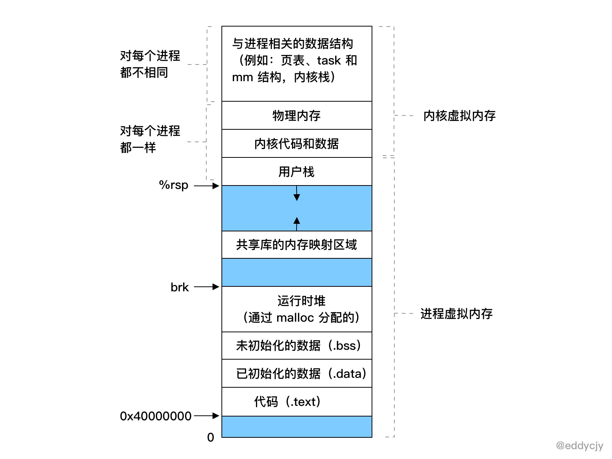
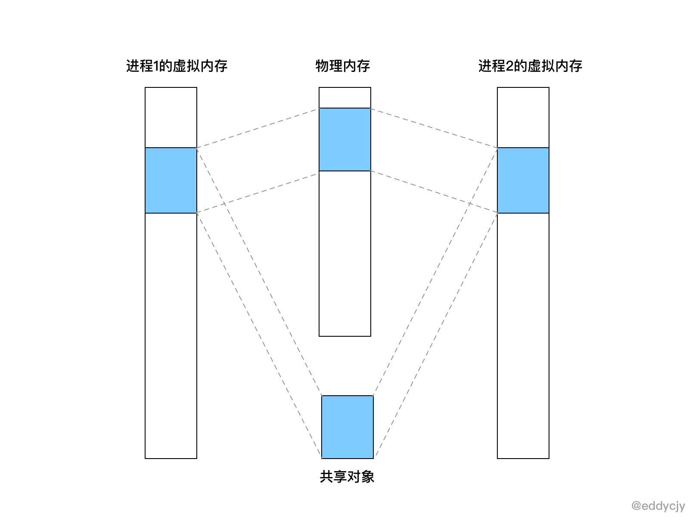

VSZ 是该进程所能使用的虚拟内存总大小，它包括进程可以访问的所有内存，其中包括了被换出的内存（Swap）、已分配但未使用的内存以及来自共享库的内存。

为什么要虚拟内存

在一个系统中的进程是与其他进程共享 CPU 和主存资源的，而在现代的操作系统中，多进程的使用非常的常见，那么如果太多的进程需要太多的内存，那么在没有虚拟内存的情况下，物理内存很可能会不够用，就会导致其中有些任务无法运行，更甚至会出现一些很奇怪的现象，例如 “某一个进程不小心写了另一个进程使用的内存”，就会造成内存破坏，因此虚拟内存是非常重要的一个媒介。

虚拟内存，又分为内核虚拟内存和进程虚拟内存，每一个进程的虚拟内存都是独立的.

在内核虚拟内存中，是包含了内核中的代码和数据结构，而内核虚拟内存中的某些区域会被映射到所有进程共享的物理页面中去，因此你会看到 ”内核虚拟内存“ 中实际上是包含了 ”物理内存“ 的，它们两者存在映射关系。而在应用场景上来讲，每个进程也会去共享内核的代码和全局数据结构，因此就会被映射到所有进程的物理页面中去。

虚拟内存的重要能力

虚拟内存是硬件异常、硬件地址翻译、主存、磁盘文件和内核软件交互的地方，它为每个进程提供了一个大的、一致的和私有的地址空间.

    它将主存看成是一个存储在磁盘上的地址空间的高速缓存，在主存中只保存活动区域，并根据需要在磁盘和主存之间来回传送数据，通过这种方式，它高效地使用了主存。
    它为每个进程提供了一致的地址空间，从而简化了内存管理。
    它保护了每个进程的地址空间不被其他进程破坏。
